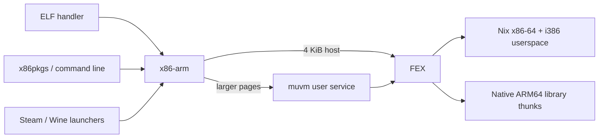

# Design

This project runs x86 Linux applications on ARM64.

## Boundaries

| Directory | Responsibility |
|---|---|
| `runtime/` | Command interface, backend selection, environment domains, VM lifecycle |
| `guest/` | Multilib package selection, closed filesystem image, VM filesystem preparation |
| `applications/` | Steam bootstrap, Wine lifetime, PressureVessel integration |
| `compat/` | Pinned emulator changes required for ABI and transport correctness |
| `nix/` | Package composition, overlay, NixOS module and build checks |
| `checks/` | Unit contracts, real image/ELF verification and live integration probes |

The overlay imports ARM64 and x86 packages from one nixpkgs revision. Image assembly uses the x86 closures and does not require an x86 builder.

The guest image uses nixpkgs' multilib application selection. It contains the copied closure, loaders, library cache, certificates, fonts, ALSA plugins and Mesa ICDs. Relative links keep FEX and PressureVessel inside the image; drivers are selected at execution time.

The VM's native `/bin` and `/usr` view contains links to a small Nix tool set. This works with muvm's noexec `/run` tmpfs and with split or merged `/usr` layouts.

## Execution

The Python entrypoint receives the executable, arguments, environment and current directory. It writes a quoted command to a private 0600 file in a 0700 directory, then runs it through the guest shell. Application environment values stay out of muvm's process arguments.

The ELF registrations use Linux's `P` flag. The interpreter receives the executable path and original `argv[0]` separately, and the guest shell's `exec -a` preserves that distinction. A fixed shell command separates `env`'s assignments from application paths, including paths containing `=`. The i386 mask uses ELF machine number 3, which also covers modern i686 binaries.

The first command in a muvm process uses the VM console, which lacks the pipe contract. The runtime starts it with a persistent native sleep process; applications use the interactive request protocol. The muvm transport patch handles independent stdin/stdout, regular-file input, complete output and signal exit codes.

Each request enters a root-owned guest cgroup before exec. Descendants keep that membership across process groups, sessions, forks and reparenting. On disconnect, muvm sends SIGTERM through pidfds, then uses `cgroup.kill` after 500 ms. This covers concurrent forks and blocked I/O without touching another request. Launcher signals are relayed to the child.

The cgroup retains descendants after the leader exits. Normal completion drains output, sends the parent's status and waits for client acknowledgement. EOF before acknowledgement cancels the request. Acknowledged children with closed stdio may finish; the cgroup is removed when empty. Missing cgroup support rejects the request before exec.

A configuration and installation-path digest identifies the transient systemd service and socket directory. `flock` serializes cold starts; a protocol request confirms readiness. The service inherits desktop endpoints, follows the graphical session, and logs failures to the user journal. Session preparation starts a shared FEXServer outside request cgroups and a guest session bus for local services such as Steam.

## Environment and graphics

The launcher, guest application and muvm display/audio endpoints have separate environments. Host loader and plugin paths are removed from the guest; ordinary application variables, arguments and the working directory are preserved.

The host bridge keeps the original PulseAudio socket and `PIPEWIRE_RUNTIME_DIR` while muvm's control sockets use a private directory. PipeWire uses that variable to locate its native endpoint ([upstream reference](https://docs.pipewire.org/page_man_pipewire_1.html)); changing only `XDG_RUNTIME_DIR` would leave the guest audio proxy waiting on the wrong host socket.

X11 socket selection is separate from `DISPLAY`. The bridge uses the conventional socket or a renamed socket owned by the user; `X11_SOCKET` overrides discovery. `doctor` reports the result.

FEX's HostEnv supplies native ICD selection without changing the guest ICD selection. This requires a downstream FEX fix: the guest environment must be copied before native `putenv` calls mutate the process environment. FEX's current configuration parser represents string arrays using repeated JSON keys; the native configuration writer follows that upstream format.

Native Vulkan filters manifests for the selected transport, then chooses the NixOS driver directory or packaged ARM Mesa. DRM uses hardware ICDs, Venus uses Virtio, and explicit software mode uses Lavapipe. The host Venus renderer keeps its hardware ICD. `nativeEnvironment` can override the native driver.

Auto mode selects DRM only on supported native-context GPUs. Software mode requires `allowSoftwareRendering` and is excluded from automatic driver selection. Venus preserves Zink; direct FEX uses the host stack.

Six forwarding families are configured. Per-application FEX settings still apply, including Steam webhelper's GL/EGL exception. The rootfs supplies x86 libraries where an ABI has no thunk.

## Scope

The VM shares the user's filesystem and credentials and provides no sandbox isolation. It targets regular user applications; inherited file descriptors, privileged execution and Nix daemon builds are outside its scope. Steam and Wine use separate launchers.
